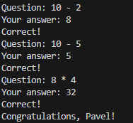
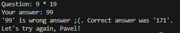
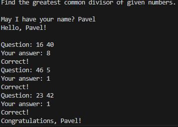
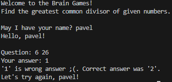
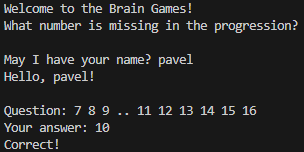
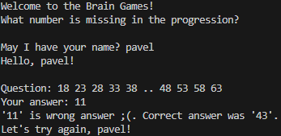
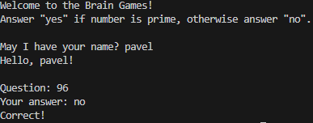
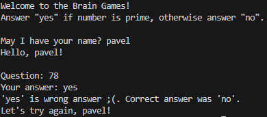

### Hexlet tests and linter status:

[](https://github.com/chudo932/frontend-project-44/actions)

# Brain Games

Набор обучающих игр для тренировки ума.

## Установка

```bash
npm install -g @hexlet/code
```

## Проверка результата

Убедитесь, что:

1. Файл `bin/brain-even.js` существует и содержит код игры.
2. В `package.json` добавлена запись `"brain-even": "bin/brain-even.js"`.
3. После `npm link` команда `brain-even` запускается и работает корректно.
4. В `README.md` есть чёткие инструкции по установке и запуску.

## Brain Calc Game

Математическая игра — вычислите результат выражения.

### Запуск игры

```bash
brain-calc
```
### Работа игры


## Brain GCD Game

Игра на нахождение наибольшего общего делителя (НОД) двух чисел.

### Запуск игры

```bash
brain-gcd
```
### Работа игры



## Brain Progression

Математическая игра: угадай пропущенное число в арифметической прогрессии.

### Запуск игры

```bash
brain-progression
```
### Работа игры



## Brain Prime

Игра на проверку простых чисел: ответьте «yes», если число простое, и «no», если составное.

### Запуск игры


```bash
brain-prime
```
### Работа игры



**Универсальный способ (рекомендуется для всех ОС):**
```bash
npm run brain-prime
```